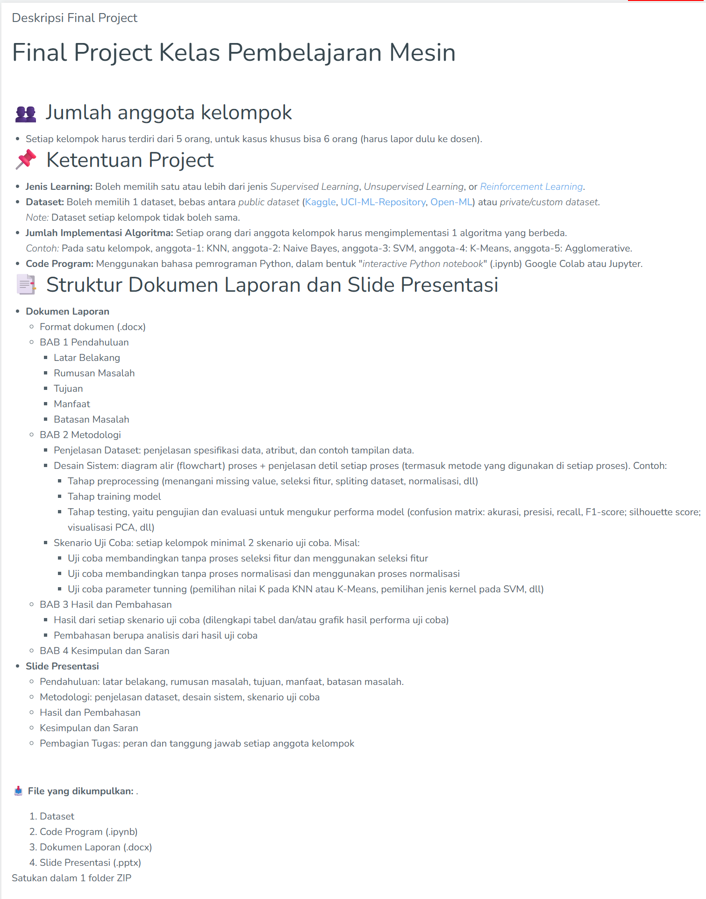

# Final Project Machine Learning

| Name           | NRP        | Kelas      | Kelompok    |
| ---            | ---        | ---------- | ---         |
| Daffa Rinali | 5025231209 | Pembelajaran Mesin (D) | Kelompok 6 |
| Algof Kristian Zega | 5025231235 | Pembelajaran Mesin (D) | Kelompok 6 |
| Filbert Hainsly Martin | 5025231256 | Pembelajaran Mesin (D) | Kelompok 6 |
| Gregorius Setiadharma | 5025231268 | Pembelajaran Mesin (D) | Kelompok 6 |
| Muhammad Davin Aulia Risky | 5025231275 | Pembelajaran Mesin (D) | Kelompok 6 |

---

## Dataset

> https://archive.ics.uci.edu/ml/machine-learning-databases/wine/wine.data

| Index | Feature Name         | Tipe    |
| ----- | -------------------- | ------- |
| 0     | class                | integer |
| 1     | Alcohol              | float   |
| 2     | Malic acid           | float   |
| 3     | Ash                  | float   |
| 4     | Alcalinity of ash    | float   |
| 5     | Magnesium            | float   |
| 6     | Total phenols        | float   |
| 7     | Flavanoids           | float   |
| 8     | Nonflavanoid phenols | float   |
| 9     | Proanthocyanins      | float   |
| 10    | Color intensity      | float   |
| 11    | Hue                  | float   |
| 12    | OD280/OD315          | float   |
| 13    | Proline              | float   |

> https://www.kaggle.com/datasets/alyelbadry/house-pricing-dataset

---

| Algoritma                     | Catatan                                                                               |
| ----------------------------- | ------------------------------------------------------------------------------------- |
| **K-Means Clustering**        | Uji tanpa label (evaluasi dengan silhouette score atau ARI)                           |
| **Hierarchical Clustering**   | Bisa divisualisasi dengan dendrogram                                                  |
| **Decision Tree**             | Klasifikasi jenis wine                                                                |
| **K-Nearest Neighbor**        | Klasifikasi jenis wine                                                                |
| **Naive Bayes**               | Klasifikasi jenis wine                                                                |
| **Support Vector Machine**    | Multiclass dengan SVM One-vs-One                                                      |
| **Regresi Linear**            | Prediksi salah satu fitur numerik dari yang lain (misalnya "Alcohol" dari fitur lain) |